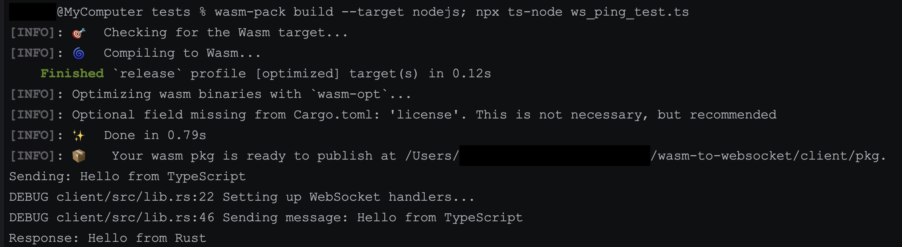

First check `../client/README.md`

### Compile for Node.js
- `cd ../` (navigate to `client` directory)
- ` wasm-pack build --target nodejs;` (this should print)  
[INFO]: 📦   Your wasm pkg is ready to publish at /Users/x/wasm-to-websocket/client/pkg
(`/Users/x/wasm-to-websocket` will show your path)

### Run test
- `npm install` (we need `ws` package in node.js environment)
- `npx ts-node ws_ping_test.ts` (it should print the following in CLI along with debug logs) 

Sending: Hello from TypeScript  
Response: Hello from Rust

