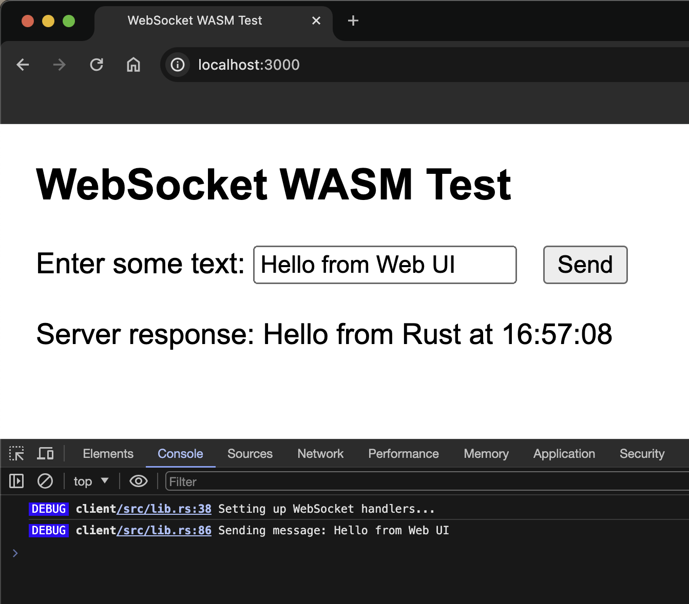
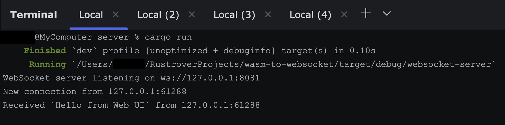

First check `../client/README.md`

### Compile for Web 
- `cd ../` (navigate to `client` directory)
- `wasm-pack build --target web` (this should print)  
[INFO]: 📦   Your wasm pkg is ready to publish at /Users/x/wasm-to-websocket/client/pkg
(`/Users/x/wasm-to-websocket` will show your path)

### Run Web Server
We need to run a web server to load the `index.html` file from `./static` path
- `cd web` (make sure to be inside `web` directory)
- `npm install` (as we need `express` js framework)
- `node server.js` (this should print)  
Serving current directory: /Users/x/wasm-to-websocket/client/web/static  
Serving pkg directory: /Users/x/wasm-to-websocket/client/pkg  
Server running at http://localhost:3000  

Click the `Send` button to check the request/response flow. It should display Websocket Server (`server/src/main.rs`) response. Also open the Browser `Console` tab to see relevant logs

